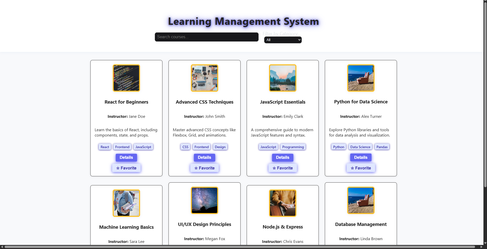

# Student Course Management Portal

> A modern, responsive web application for managing and browsing student courses. Built with React and Vite, leveraging mock JSON data for demonstration and testing purposes.

## 🌐 Live Demo

[View the deployed app on Vercel](https://coursehub-pi.vercel.app/)

---

## 🖼️ Screenshot



---

## 🚀 Features

- **Clean UI/UX:** Modern, intuitive, and visually appealing interface.
- **Styling:** CSS
- **Data:** Mock JSON (`public/mock-courses.json`)

---

## 📦 Project Structure


## 💡 Assumptions & Bonus Features

- Data is loaded from a static JSON file (`mock-courses.json`).
- Favorites are stored in memory (not persisted).
- Modal for course details.
- UI/UX follows modern design principles.
- Easily extendable for backend/API integration.

---
└── package.json              # Project metadata & dependencies
```

---

## ⚡️ Getting Started

1. **Install dependencies:**
	```bash
	npm install
	```
2. **Start the development server:**
	```bash
	npm run dev
	```
3. **Open your browser:**
	Visit [http://localhost:5173](http://localhost:5173) (or the port shown in your terminal).

---

## 💡 Assumptions & Bonus Features

- Data is loaded from a static JSON file (`mock-courses.json`).
- Favorites are stored in memory (not persisted).
- Modal for course details.
- UI/UX follows modern design principles.
- Easily extendable for backend/API integration.

---

## 📚 Data Model

Each course object contains:

```json
{
  "id": 1,
  "title": "Course Title",
  "instructor": "Instructor Name",
  "description": "Course description...",
  "tags": ["Tag1", "Tag2"],
  "category": "Category",
  "image": "Image URL",
  "favorite": false
}
```

---

## 📝 Documentation & Presentation

- This README provides setup, tech stack, code structure, and feature overview.
- Screenshots and screen recordings recommended for visual presentation.
- Code is modular, readable, and follows best practices.

---

## 📈 Extending the Project

- Integrate with a backend/API for real data.
- Add authentication, user profiles, or admin features.
- Enhance UI with animations or advanced filtering.

---

## 👨‍💻 Author & License

- _Developed by [Rakesh Yadav]_  
- _MIT License_
